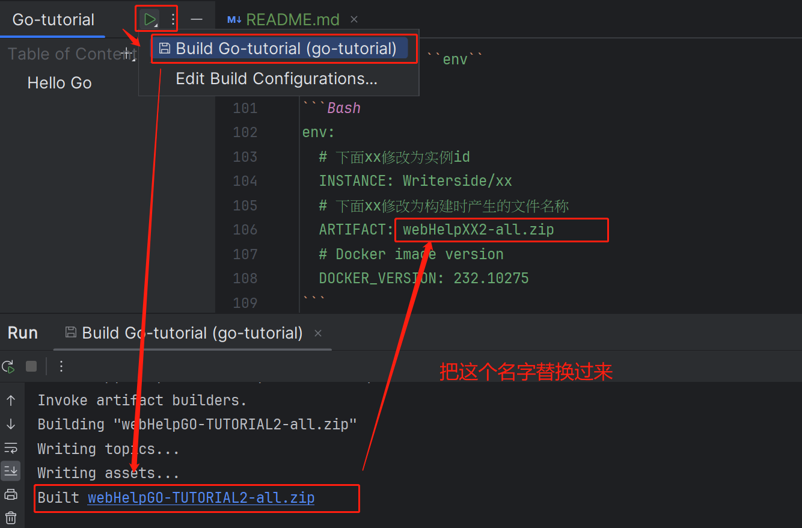

# go-tutorial

这是使用 Writerside 编写文档并自动部署到 GitHub pages 的教程

## Writerside

Writerside 是一款基于 IntelliJ 平台的 JetBrains IDE。用它来创作、构建、测试和发布技术文档。

## 部署方法

- 使用 Writerside 创建项目，编写文档，定义实例的相关信息

寻找设置


进行编辑


- 创建自动工作流配置.github/workflows/deploy.yml 文件

```Bash
name: Build documentation

on:
  push:
    # To trigger the workflow once you push to the `main` branch
    # Replace `main` with your branch’s name
    branches: ["main"]
  # Specify to run a workflow manually from the Actions tab on GitHub
  workflow_dispatch:

permissions:
  id-token: write
  pages: write

env:
  # Name of module and id separated by a slash
  INSTANCE: Writerside/xx
  # Replace XX with the ID of the instance in capital letters
  ARTIFACT: webHelpXX2-all.zip
  # Docker image version
  DOCKER_VERSION: 232.10275

jobs:
  build:
    runs-on: ubuntu-latest
    
    steps:
      - name: Checkout repository
        uses: actions/checkout@v3

      - name: Build Writerside docs using Docker
        uses: JetBrains/writerside-github-action@v4
        with:
          instance: ${{ env.INSTANCE }}
          artifact: ${{ env.ARTIFACT }}
          docker-version: ${{ env.DOCKER_VERSION }}
        
      - name: Upload artifact
        uses: actions/upload-artifact@v3
        with:
          name: docs
          path: |
            artifacts/${{ env.ARTIFACT }}
          retention-days: 7

  deploy:
    environment:
      name: github-pages
      url: ${{ steps.deployment.outputs.page_url }}
    # Requires build job results
    needs: build
    runs-on: ubuntu-latest

    steps:
      - name: Download artifact
        uses: actions/download-artifact@v3
        with:
          name: docs

      - name: Unzip artifact
        run: unzip -O UTF-8 -qq ${{ env.ARTIFACT }} -d dir

      - name: Setup Pages
        uses: actions/configure-pages@v2
      
      - name: Upload artifact
        uses: actions/upload-pages-artifact@v1
        with:
          path: dir
      
      - name: Deploy to GitHub Pages
        id: deployment
        uses: actions/deploy-pages@v1
```

要修改的部分只有 ``env``

```Bash
env:
  # 下面xx修改为实例id
  INSTANCE: Writerside/xx
  # 下面xx修改为构建时产生的文件名称（具体说明看下方图片）
  ARTIFACT: webHelpXX2-all.zip
  # Docker image version
  DOCKER_VERSION: 232.10275
```



修改完后应该是

```Bash
env:
  # Name of module and id separated by a slash
  INSTANCE: Writerside/go-tutorial
  # Replace XX with the ID of the instance in capital letters
  ARTIFACT: webHelpGO-TUTORIAL2-all.zip
  # Docker image version
  DOCKER_VERSION: 232.10275
```

完整文件请看我的.github/workflows/deploy.yml

- 创建对应的公开 GitHub rope, 在 GitHub pages 里调整使用 Github Actions 构建

详细说明


- 向上推送，享受自动构建的快乐~

## 答疑区

<!DOCTYPE html>
<html>
    <body>
        <script src="https://giscus.app/client.js"
                data-repo="lushi78778/go-tutorial"
                data-repo-id="R_kgDOK9X-Kg"
                data-category="Announcements"
                data-category-id="DIC_kwDOK9X-Ks4Cb-PJ"
                data-mapping="title"
                data-strict="0"
                data-reactions-enabled="1"
                data-emit-metadata="1"
                data-input-position="top"
                data-theme="preferred_color_scheme"
                data-lang="zh-CN"
                data-loading="lazy"
                crossorigin="anonymous"
                async>
        </script>
    </body>
</html>

## Reference

https://www.jetbrains.com/help/writerside/deploy-docs-to-github-pages.html